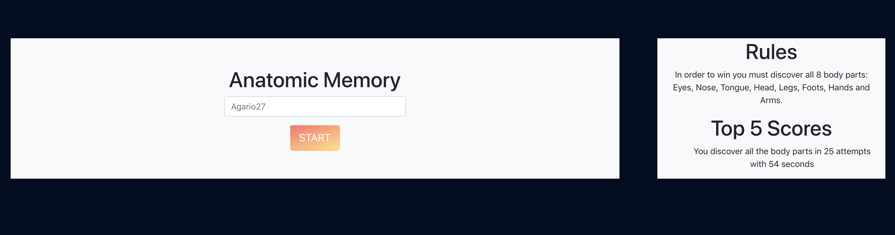

<!--
*** Thanks for checking out this README Template. If you have a suggestion that would
*** make this better, please fork the micro-games-platform and create a pull request or simply open
*** an issue with the tag "enhancement".
*** Thanks again! Now go create something AMAZING! :D
***
***
***
*** To avoid retyping too much info. Do a search and replace for the following:
*** victorgreco, micro-games-platform, twitter_handle, email
-->


<!-- PROJECT SHIELDS -->
<!--
*** I'm using markdown "reference style" links for readability.
*** Reference links are enclosed in brackets [ ] instead of parentheses ( ).
*** See the bottom of this document for the declaration of the reference variables
*** for contributors-url, forks-url, etc. This is an optional, concise syntax you may use.
*** https://www.markdownguide.org/basic-syntax/#reference-style-links
-->
[](https://app.netlify.com/sites/eloquent-gates-1aa469/deploys)
[![Contributors][contributors-shield]][contributors-url]
[![Forks][forks-shield]][forks-url]
[![Stargazers][stars-shield]][stars-url]
[![Issues][issues-shield]][issues-url]
[![MIT License][license-shield]][license-url]
[![LinkedIn][linkedin-shield]][linkedin-url]

<!-- PROJECT LOGO -->
<br />
<p align="center">
  <a href="https://github.com/victorgreco/micro-games-platform">
    
  </a>

  <h3 align="center">µGames platform</h3>

  <p align="center">
    Intuitive and modern platform with a variety of games for all ages. The idea behind was to make a sort of games catalog for my nice how's 4 years old.
    <br />
    <a href="https://github.com/victorgreco/micro-games-platform"><strong>Explore the docs »</strong></a>
    <br />
    <br />
    <a href="https://github.com/victorgreco/micro-games-platform">View Demo</a>
    ·
    <a href="https://github.com/victorgreco/micro-games-platform/issues">report Bug</a>
    ·
    <a href="https://github.com/victorgreco/micro-games-platform/issues">Request Feature</a>
  </p>
</p>

<!-- TABLE OF CONTENTS -->
## Table of Contents

* [About the Project](#about-the-project)
* [Built With](#built-with)
* [Getting Started](#getting-started)
  * [Prerequisites](#prerequisites)
  * [Installation](#installation)
* [Usage](#usage)
* [Roadmap](#roadmap)
* [Contributing](#contributing)
* [License](#license)
* [Contact](#contact)

<!-- ABOUT THE PROJECT -->
## About The Project

[![Product Name Screen Shot][product-screenshot]](https://example.com)

On the screenshot above we have the homepage of **µGames platform**. You can see the full catalog of games with some important information of each one such as **title**, **categories**, **brief description** and **start button** which routes us into the game.

The app is also fully responsive for **Desktop**, **Mobile** and **Tablet**.


### Filter by Title


### Filter by description


## Games Catalog


## Hangman


## Memory 




### Built With

* [ReactJS]()
* [Bootstrap]()
* [Jest]()
* [TypeScript]()

<!-- GETTING STARTED -->
## Getting Started with µGames platform

This project was bootstrapped with [Create React App](https://github.com/facebook/create-react-app).

### Available Scripts

In the project directory, you can run:

#### `npm  run start`

Runs the app in the development mode.\
Open [http://localhost:3000](http://localhost:3000) to view it in the browser.

The page will reload if you make edits.\
You will also see any lint errors in the console.

#### `npm run test`

Launches the test runner in the interactive watch mode.\
See the section about [running tests](https://facebook.github.io/create-react-app/docs/running-tests) for more information.

#### `npm run build`

Builds the app for production to the `build` folder.\
It correctly bundles React in production mode and optimizes the build for the best performance.

The build is minified and the filenames include the hashes.\
Your app is ready to be deployed!

See the section about [deployment](https://facebook.github.io/create-react-app/docs/deployment) for more information.

## Learn More

You can learn more in the [Create React App documentation](https://facebook.github.io/create-react-app/docs/getting-started).

To learn React, check out the [React documentation](https://reactjs.org/).

### Prerequisites

* npm

### Installation

1. Clone the micro-games-platform
```sh
git clone https://github.com/victorgreco/micro-games-platform.git
```
2. Install NPM packages
```sh
npm install
```
3. Build NPM packages
```sh
npm run build
```
4. Start localhost
```sh
npm run start
```

<!-- ROADMAP -->
## Roadmap

See the [open issues](https://github.com/victorgreco/micro-games-platform/issues) for a list of proposed features (and known issues).

<!-- CONTRIBUTING -->
## Contributing

Contributions are what make the open source community such an amazing place to be learn, inspire, and create. Any contributions you make are **greatly appreciated**.

1. Fork the Project
2. Create your Feature Branch (`git checkout -b feature/AmazingFeature`)
3. Commit your Changes (`git commit -m 'Add some AmazingFeature'`)
4. Push to the Branch (`git push origin feature/AmazingFeature`)
5. Open a Pull Request

<!-- LICENSE -->
## License

Distributed under the MIT License. See `LICENSE` for more information.

<!-- CONTACT -->
## Contact

Victor Greco - [linkedin](https://www.linkedin.com/in/victor-greco/) - victorgreco263@gmail.com

Project Link: [https://github.com/victorgreco/micro-games-platform](https://github.com/victorgreco/micro-games-platform)


<!-- MARKDOWN LINKS & IMAGES -->
<!-- https://www.markdownguide.org/basic-syntax/#reference-style-links -->
[contributors-shield]: https://img.shields.io/github/contributors/victorgreco/micro-games-platform.svg?style=flat-square
[contributors-url]: https://github.com/victorgreco/micro-games-platform/graphs/contributors
[forks-shield]: https://img.shields.io/github/forks/victorgreco/micro-games-platform.svg?style=flat-square
[forks-url]: https://github.com/victorgreco/micro-games-platform/network/members
[stars-shield]: https://img.shields.io/github/stars/victorgreco/micro-games-platform.svg?style=flat-square
[stars-url]: https://github.com/victorgreco/micro-games-platform/stargazers
[issues-shield]: https://img.shields.io/github/issues/victorgreco/micro-games-platform.svg?style=flat-square
[issues-url]: https://github.com/victorgreco/micro-games-platform/issues
[license-shield]: https://img.shields.io/github/license/victorgreco/micro-games-platform.svg?style=flat-square
[license-url]: https://github.com/victorgreco/micro-games-platform/blob/master/LICENSE.txt
[linkedin-shield]: https://img.shields.io/badge/-LinkedIn-black.svg?style=flat-square&logo=linkedin&colorB=555
[linkedin-url]: https://www.linkedin.com/in/victor-greco/
[product-screenshot]: src/resources/docs/home/home_desktop.png
